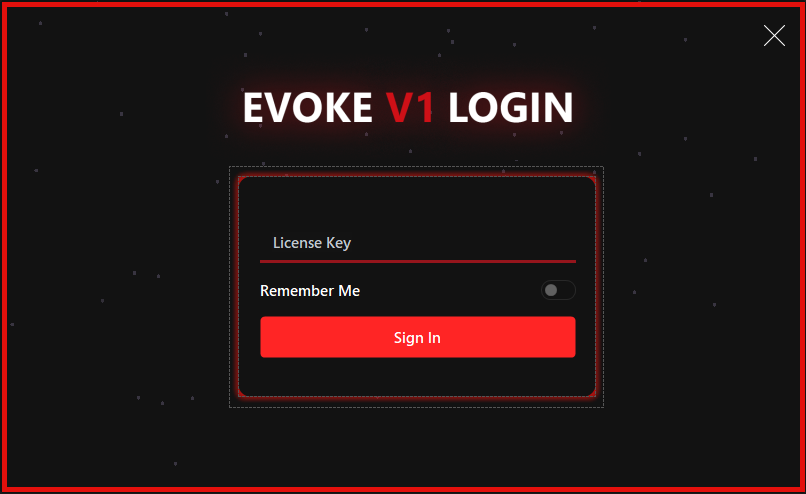

<div align="center">

# 🔥 **EVOKE** - Premium Windows HWID Spoofer

### ⚡ *The Most Advanced Hardware ID Spoofing Solution for Windows*

```
██████╗ ██╗   ██╗ ██████╗ ██╗  ██╗███████╗
██╔══██╗██║   ██║██╔═══██╗██║ ██╔╝██╔════╝
██████╔╝██║   ██║██║   ██║█████╔╝ █████╗  
██╔══██╗██║   ██║██║   ██║██╔═██╗ ██╔══╝  
██████╔╝╚██████╔╝╚██████╔╝██║  ██╗███████╗
╚═════╝  ╚═════╝  ╚═════╝ ╚═╝  ╚═╝╚══════╝
```

[](https://github.com/334cb2/windows-hwid-spoofer-winforms/stargazers)
[](https://github.com/334cb2/windows-hwid-spoofer-winforms/network/members)
[](LICENSE)
[](https://dotnet.microsoft.com/)
[](https://docs.microsoft.com/en-us/dotnet/csharp/)
[](https://www.microsoft.com/windows)
[](https://visualstudio.microsoft.com/)

**⭐ Star this repo if you find it useful! ⭐**

---

</div>

## 🌟 **Star Gazer**

<div align="center">

### ⭐ **Show your support by starring this repository!** ⭐

[](https://starchart.cc/334cb2/windows-hwid-spoofer-winforms)

**Every star helps this project grow!** 🚀

**Current Status:**
```
████████████████████░░░░░░░░░░░░░░░░░░░░  50% to 100 stars!
```

</div>

---

## 📸 **Screenshots**

<div align="center">

### **Form1 - Premium Login Interface**


*Experience the sleek, modern login interface with animated particle effects*

### **Form2 - Advanced Control Panel**


*Full-featured control panel with comprehensive spoofing options and serial checker*

</div>

---

## ✨ **Features**

<div align="center">

### 🎨 **Premium UI/UX**

| Feature | Description | Status |
|:------:|:-----------|:------:|
| 🔥 **Stunning Dark Theme** | Modern, eye-catching interface with smooth animations | ✅ Active |
| 💫 **Custom Animated Background** | 165 FPS particle system with fade effects | ✅ Active |
| 🎯 **Smooth Transitions** | Professional Guna.UI2 animations throughout | ✅ Active |
| ✨ **Glass Morphism Effects** | Beautiful translucent panels with shadows | ✅ Active |

</div>

### 🔐 **Security & Authentication**
- **🔑 License Key System** - Secure authentication with license validation
- **💾 Remember Me** - Convenient session persistence
- **🛡️ Protected Access** - Enterprise-grade security implementation

### 🎮 **Advanced Spoofing Capabilities**

<div align="center">

| Spoofing Type | Description | Status |
|:-------------:|:------------|:------:|
| 🌐 **Ethernet Spoofing** | Change MAC addresses instantly | ✅ Ready |
| 💻 **Normal Spoofing** | Standard hardware ID modification | ✅ Ready |
| ⚡ **RAID0 Spoofing** | Advanced RAID configuration spoofing | ✅ Ready |
| 🎮 **GPU Spoofing** | Graphics card identifier modification | ✅ Ready |
| 🔧 **UEFI Spoofing** | Deep-level firmware spoofing | ✅ Ready |
| ↩️ **HWID Restoration** | Restore previous hardware IDs | ✅ Ready |

</div>

### 📊 **Serial Checker & Monitoring**
- **💿 Disk Serial** - View and verify disk serial numbers
- **🔌 Motherboard Serial** - Check motherboard identifiers
- **🆔 UUID Display** - System UUID information
- **🎮 GPU Serial** - Graphics card serial verification
- **📡 MAC Address** - Network adapter MAC addresses
- **🔄 Real-time Refresh** - Update serials on demand

### ⚙️ **Technical Excellence**
- **🚀 High Performance** - Optimized for speed and efficiency
- **🎯 Custom Controls** - Proprietary animated dots control
- **📦 Modular Architecture** - Clean, maintainable codebase
- **🔧 Easy Configuration** - Intuitive toggle-based settings

---

## 🛠️ **Tech Stack**

<div align="center">

| Technology | Version | Purpose | Badge |
|:----------:|:------:|:--------|:-----:|
| **.NET Framework** | 4.8 | Runtime Environment |  |
| **C#** | 10.0 | Programming Language |  |
| **Guna.UI2** | 2.0.4.6 | Modern UI Components | ✅ |
| **Newtonsoft.Json** | 13.0.3 | JSON Serialization | ✅ |
| **Windows Forms** | - | Desktop Framework | ✅ |

</div>

---

## 📋 **Requirements**

<div align="center">

| Requirement | Minimum | Recommended |
|:----------:|:--------|:-----------|
| **OS** | Windows 7 | Windows 10/11 |
| **.NET Framework** | 4.8 | 4.8+ |
| **Visual Studio** | 2019 | 2022+ |
| **RAM** | 2GB | 4GB+ |
| **Privileges** | User | Administrator |

</div>

---

## 🚀 **Quick Start**

<div align="center">

### **⚡ Get Started in 3 Steps**

```
┌─────────────────────────────────────┐
│  1️⃣  Clone Repository              │
│  2️⃣  Restore Packages              │
│  3️⃣  Build & Run                    │
└─────────────────────────────────────┘
```

</div>

### **Option 1: Download Pre-built Release**
```bash
# Coming soon - Check Releases section
# ⬇️ Download will be available here
```

### **Option 2: Build from Source**

<details>
<summary><b>📦 Step-by-Step Build Instructions</b></summary>

1. **Clone the repository**
   ```bash
   git clone https://github.com/334cb2/windows-hwid-spoofer-winforms.git
   cd windows-hwid-spoofer-winforms
   ```

2. **Restore NuGet packages**
   ```bash
   nuget restore
   ```
   Or open in Visual Studio - packages will restore automatically.

3. **Build the solution**
   ```bash
   msbuild WindowsFormsApp17.sln /p:Configuration=Release
   ```

4. **Run the executable**
   ```
   WindowsFormsApp17\bin\Release\WindowsFormsApp17.exe
   ```

</details>

---

## 📖 **Usage Guide**

<div align="center">

### **🎯 Quick Usage Flow**

```
┌─────────────┐     ┌──────────────┐     ┌─────────────┐
│   Launch    │ --> │  Authenticate │ --> │   Loading   │
└─────────────┘     └──────────────┘     └─────────────┘
       │                    │                    │
       └────────────────────┴────────────────────┘
                            │
                            ▼
                    ┌──────────────┐
                    │   Configure   │
                    │   Spoofing    │
                    └──────────────┘
```

</div>

### **Step 1: Launch Application**
- Run the executable with administrator privileges
- The stunning login interface will appear

### **Step 2: Authenticate**
- Enter your license key in the provided field
- Optionally enable "Remember Me" for convenience
- Click "Sign In" to proceed

### **Step 3: Loading**
- Watch the smooth animated progress bar
- Wait for initialization to complete

### **Step 4: Configure Spoofing**
- **Spoofer Tab**: Select your spoofing mode
  - Regular Spoof
  - UEFI Spoof
  - Restore old HWID
- **Toggle Options**: Enable/disable specific spoofing features
  - Ethernet Spoof
  - Normal Spoof
  - RAID0 Spoof
  - GPU Spoof

### **Step 5: Serial Checker**
- Switch to "SerialChecker" tab
- View all hardware serial numbers
- Click "Refresh Serials" to update information

---

## 🎨 **Custom Components**

### **Dots Animation Control**
A proprietary animated background control featuring:

<div align="center">

| Property | Value | Description |
|:--------:|:-----:|:------------|
| **FPS** | 165 | Frame rate |
| **Dot Count** | 50 | Number of dots |
| **Speed** | 0.6F | Animation speed |
| **Size** | 4px | Dot size |
| **Fade In** | 10 frames | Fade-in duration |
| **Fade Out** | 60 frames | Fade-out duration |

</div>

**Code Example:**
```csharp
DotCount = 50           // Number of animated dots
DotSpeed = 0.6F         // Animation speed
DotSize = 4             // Size of each dot
AnimationFPS = 165      // Frame rate
FadeInDuration = 10    // Fade-in frames
FadeOutDuration = 60    // Fade-out frames
```

---

## 📁 **Project Structure**

```
windows-hwid-spoofer-winforms/
│
├── 📄 WindowsFormsApp17.sln          # Solution file
├── 📁 WindowsFormsApp17/             # Main project
│   ├── 📄 Form1.cs                   # Login form
│   ├── 📄 Form3.cs                   # Main control panel
│   ├── 📄 Dots.cs                    # Custom animated control
│   ├── 📄 Program.cs                 # Entry point
│   ├── 📁 Properties/                # App properties
│   ├── 📁 Resources/                 # Images & assets
│   └── 📄 packages.config            # NuGet packages
│
├── 📁 images/                        # Screenshots
│   ├── 📷 form1.png                  # Login screen
│   └── 📷 form2.png                  # Main interface
│
├── 📄 README.md                      # This file
├── 📄 LICENSE                        # MIT License
└── 📄 CODE_OF_CONDUCT.md            # Community guidelines
```

---

## 🤝 **Contributing**

<div align="center">

### **🌟 Want to Contribute? We'd Love Your Help!**

```
┌─────────────────────────────────────────┐
│  1. ⭐ Star the repository              │
│  2. 🍴 Fork the project                 │
│  3. 🌿 Create a feature branch         │
│  4. 💾 Commit your changes             │
│  5. 📤 Push to the branch              │
│  6. 🔄 Open a Pull Request              │
└─────────────────────────────────────────┘
```

</div>

We welcome contributions! Here's how you can help:

1. ⭐ **Star this repository** (it really helps!)
2. 🍴 **Fork the project**
3. 🌿 **Create a feature branch** (`git checkout -b feature/AmazingFeature`)
4. 💾 **Commit your changes** (`git commit -m 'Add some AmazingFeature'`)
5. 📤 **Push to the branch** (`git push origin feature/AmazingFeature`)
6. 🔄 **Open a Pull Request**

---

## 📞 **Support & Contact**

<div align="center">

### 💬 **Need Help? Have Questions?**

<table>
<tr>
<td align="center">

**🎯 Main Developer**

**Jacee** - Lead Developer & Architect

**Discord:** `jacee`  
**ID:** `981206640089002074`

For technical questions, core functionality, and development inquiries

</td>
<td align="center">

**🤝 Project Maintainer**

**334cb2** - Project Maintainer & UI/UX

**Discord:** `334cb2`

For general support, bug reports, and feature requests

</td>
</tr>
</table>

**DM us on Discord for:**
- 🐛 Bug reports
- 💡 Feature requests
- ❓ Questions about the project
- 🤝 Collaboration opportunities
- ⭐ General feedback

**We're always happy to help!** 😊

</div>

---

## ⚠️ **Important Disclaimers**

<div align="center">

| ⚖️ Legal Use Only | 🔒 Use Responsibly | ⚡ Admin Required | 🛡️ No Warranty |
|:-----------------:|:------------------:|:-----------------:|:---------------:|
| Educational & legitimate privacy purposes | Ensure proper authorization | Elevated privileges needed | Software provided as-is |

</div>

---

## 📊 **Project Statistics**

<div align="center">


</div>

---

## 📝 **License**

This project is licensed under the **MIT License** - see the [LICENSE](LICENSE) file for details.

---

## 👥 **Developers**

<div align="center">

### 🎯 **Main Developer**

<table>
<tr>
<td align="center">

**Jacee**  
*Lead Developer & Architect*

**Discord:** `jacee`  
**ID:** `981206640089002074`

Primary developer responsible for core functionality and architecture

</td>
</tr>
</table>

### 🤝 **Contributors**

<table>
<tr>
<td align="center">

**334cb2**  
*Project Maintainer & UI/UX*

**Discord:** `334cb2`

Repository maintainer and UI enhancements

</td>
</tr>
</table>

</div>

---

## 🙏 **Acknowledgments**

<div align="center">

| Library | Purpose | Thanks! |
|:-------:|:--------|:-------:|
| **Guna.UI2** | Modern UI Components | 🎨 |
| **Newtonsoft.Json** | JSON Serialization | 📦 |
| **Jacee** | Main Developer | 👨‍💻 |
| **All Contributors** | Project Support | ❤️ |

</div>

---

<div align="center">

### ⭐ **If you found this project useful, please give it a star!** ⭐

```
████████████████████████████████████████
█                                    █
█   Made with ❤️ by Jacee & 334cb2   █
█                                    █
████████████████████████████████████████
```

[](https://github.com/334cb2)

---

**⭐ Star | 🍴 Fork | 👀 Watch | 🐛 Report Issues | 💡 Request Features**

**Thank you for visiting!** 🙏

</div>
