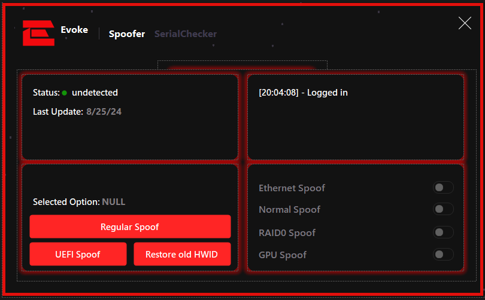

<div align="center">

# 🔥 **EVOKE** - Premium Windows HWID Spoofer

### ⚡ *The Most Advanced Hardware ID Spoofing Solution for Windows*

[](https://github.com/334cb2/windows-hwid-spoofer-winforms/stargazers)
[](https://github.com/334cb2/windows-hwid-spoofer-winforms/network/members)
[](LICENSE)
[](https://dotnet.microsoft.com/)
[](https://docs.microsoft.com/en-us/dotnet/csharp/)

**⭐ Star this repo if you find it useful! ⭐**

---

</div>

## 🌟 **Star Gazer**

<div align="center">

### ⭐ **Show your support by starring this repository!** ⭐

[](https://starchart.cc/334cb2/windows-hwid-spoofer-winforms)

**Every star helps this project grow!** 🚀

</div>

---

## 📸 **Screenshots**

<div align="center">

### **Form1 - Premium Login Interface**


*Experience the sleek, modern login interface with animated particle effects*

### **Form2 - Advanced Control Panel**


*Full-featured control panel with comprehensive spoofing options and serial checker*

</div>

---

## ✨ **Features**

### 🎨 **Premium UI/UX**
- **🔥 Stunning Dark Theme** - Modern, eye-catching interface with smooth animations
- **💫 Custom Animated Background** - 165 FPS particle system with fade effects
- **🎯 Smooth Transitions** - Professional Guna.UI2 animations throughout
- **✨ Glass Morphism Effects** - Beautiful translucent panels with shadows

### 🔐 **Security & Authentication**
- **🔑 License Key System** - Secure authentication with license validation
- **💾 Remember Me** - Convenient session persistence
- **🛡️ Protected Access** - Enterprise-grade security implementation

### 🎮 **Advanced Spoofing Capabilities**
- **🌐 Ethernet Spoofing** - Change MAC addresses instantly
- **💻 Normal Spoofing** - Standard hardware ID modification
- **⚡ RAID0 Spoofing** - Advanced RAID configuration spoofing
- **🎮 GPU Spoofing** - Graphics card identifier modification
- **🔧 UEFI Spoofing** - Deep-level firmware spoofing
- **↩️ HWID Restoration** - Restore previous hardware IDs

### 📊 **Serial Checker & Monitoring**
- **💿 Disk Serial** - View and verify disk serial numbers
- **🔌 Motherboard Serial** - Check motherboard identifiers
- **🆔 UUID Display** - System UUID information
- **🎮 GPU Serial** - Graphics card serial verification
- **📡 MAC Address** - Network adapter MAC addresses
- **🔄 Real-time Refresh** - Update serials on demand

### ⚙️ **Technical Excellence**
- **🚀 High Performance** - Optimized for speed and efficiency
- **🎯 Custom Controls** - Proprietary animated dots control
- **📦 Modular Architecture** - Clean, maintainable codebase
- **🔧 Easy Configuration** - Intuitive toggle-based settings

---

## 🛠️ **Tech Stack**

<div align="center">

| Technology | Version | Purpose |
|:----------:|:------:|:--------|
| **.NET Framework** | 4.8 | Runtime Environment |
| **C#** | 10.0 | Programming Language |
| **Guna.UI2** | 2.0.4.6 | Modern UI Components |
| **Newtonsoft.Json** | 13.0.3 | JSON Serialization |
| **Windows Forms** | - | Desktop Framework |

</div>

---

## 📋 **Requirements**

- ✅ **Windows 7** or later
- ✅ **.NET Framework 4.8** or higher
- ✅ **Visual Studio 2019+** (for building from source)
- ✅ **Administrator privileges** (for hardware operations)

---

## 🚀 **Quick Start**

### **Option 1: Download Pre-built Release**
```bash
# Coming soon - Check Releases section
```

### **Option 2: Build from Source**

1. **Clone the repository**
   ```bash
   git clone https://github.com/334cb2/windows-hwid-spoofer-winforms.git
   cd windows-hwid-spoofer-winforms
   ```

2. **Restore NuGet packages**
   ```bash
   nuget restore
   ```
   Or open in Visual Studio - packages will restore automatically.

3. **Build the solution**
   ```bash
   msbuild WindowsFormsApp17.sln /p:Configuration=Release
   ```

4. **Run the executable**
   ```
   WindowsFormsApp17\bin\Release\WindowsFormsApp17.exe
   ```

---

## 📖 **Usage Guide**

### **Step 1: Launch Application**
- Run the executable with administrator privileges
- The stunning login interface will appear

### **Step 2: Authenticate**
- Enter your license key in the provided field
- Optionally enable "Remember Me" for convenience
- Click "Sign In" to proceed

### **Step 3: Loading**
- Watch the smooth animated progress bar
- Wait for initialization to complete

### **Step 4: Configure Spoofing**
- **Spoofer Tab**: Select your spoofing mode
  - Regular Spoof
  - UEFI Spoof
  - Restore old HWID
- **Toggle Options**: Enable/disable specific spoofing features
  - Ethernet Spoof
  - Normal Spoof
  - RAID0 Spoof
  - GPU Spoof

### **Step 5: Serial Checker**
- Switch to "SerialChecker" tab
- View all hardware serial numbers
- Click "Refresh Serials" to update information

---

## 🎨 **Custom Components**

### **Dots Animation Control**
A proprietary animated background control featuring:
- **165 FPS** smooth animation
- **Configurable dot count** (default: 50)
- **Fade in/out effects** for visual appeal
- **Customizable colors** and speeds
- **Double-buffered rendering** for performance

**Properties:**
```csharp
DotCount = 50           // Number of animated dots
DotSpeed = 0.6F         // Animation speed
DotSize = 4             // Size of each dot
AnimationFPS = 165      // Frame rate
FadeInDuration = 10    // Fade-in frames
FadeOutDuration = 60    // Fade-out frames
```

---

## 📁 **Project Structure**

```
windows-hwid-spoofer-winforms/
├── 📄 WindowsFormsApp17.sln          # Solution file
├── 📁 WindowsFormsApp17/             # Main project
│   ├── 📄 Form1.cs                   # Login form
│   ├── 📄 Form3.cs                   # Main control panel
│   ├── 📄 Dots.cs                    # Custom animated control
│   ├── 📄 Program.cs                 # Entry point
│   ├── 📁 Properties/                # App properties
│   ├── 📁 Resources/                 # Images & assets
│   └── 📄 packages.config            # NuGet packages
├── 📁 images/                        # Screenshots
├── 📄 README.md                      # This file
├── 📄 LICENSE                        # MIT License
└── 📄 CODE_OF_CONDUCT.md            # Community guidelines
```

---

## 🤝 **Contributing**

We welcome contributions! Here's how you can help:

1. ⭐ **Star this repository** (it really helps!)
2. 🍴 **Fork the project**
3. 🌿 **Create a feature branch** (`git checkout -b feature/AmazingFeature`)
4. 💾 **Commit your changes** (`git commit -m 'Add some AmazingFeature'`)
5. 📤 **Push to the branch** (`git push origin feature/AmazingFeature`)
6. 🔄 **Open a Pull Request**

---

## 📞 **Support & Contact**

<div align="center">

### 💬 **Need Help? Have Questions?**

**Discord:** `334cb2`

**DM me on Discord for:**
- 🐛 Bug reports
- 💡 Feature requests
- ❓ Questions about the project
- 🤝 Collaboration opportunities
- ⭐ General feedback

**I'm always happy to help!** 😊

</div>

---

## ⚠️ **Important Disclaimers**

- ⚖️ **Legal Use Only** - This software is for educational and legitimate privacy purposes
- 🔒 **Use Responsibly** - Ensure you have proper authorization before use
- ⚡ **Administrator Required** - Some features require elevated privileges
- 🛡️ **No Warranty** - Software provided as-is without any guarantees

---

## 📊 **Project Statistics**

<div align="center">


</div>

---

## 📝 **License**

This project is licensed under the **MIT License** - see the [LICENSE](LICENSE) file for details.

---

## 🙏 **Acknowledgments**

- **Guna.UI2** - For the amazing UI components
- **Newtonsoft.Json** - For JSON serialization
- **All Contributors** - Thanks to everyone who helps improve this project!

---

<div align="center">

### ⭐ **If you found this project useful, please give it a star!** ⭐

**Made with ❤️ by [334cb2](https://github.com/334cb2)**

[](https://github.com/334cb2)

---

**⭐ Star | 🍴 Fork | 👀 Watch | 🐛 Report Issues | 💡 Request Features**

</div>
